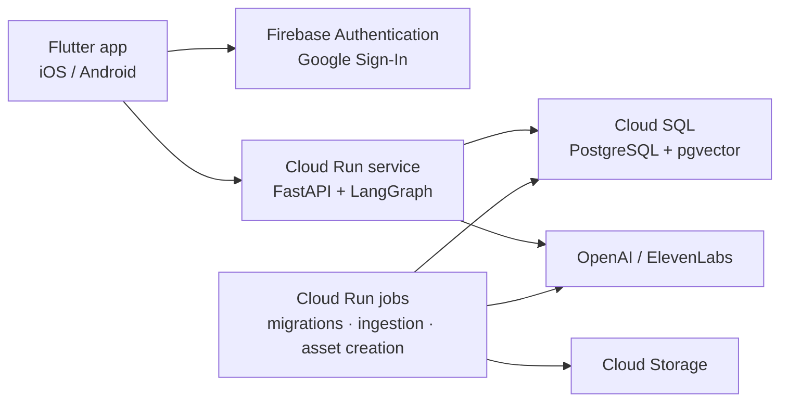

# Wobot

Wobot is an AI spokesperson app for a gerontechnology research center and its
affiliated smart-care company. It answers questions grounded in approved
sources — the organizations' public websites and a product catalog — recommends
smart-care products neutrally, and talks through either a text chat or a
personalized cartoon avatar that speaks with the user's cloned voice.

It is built for an internal pilot of up to ten people.

**Status:** Phases 0 and A are done. The iOS app signs in with Google, and the API
on Cloud Run checks the Firebase ID token and an allowlist in Cloud SQL; CI deploys
every merge to `main`. A Cloud Run job ingests the two websites, their images, three
PDFs and the product catalog into versioned, embedded knowledge once a month, and a
labelled evaluation set scores lists, fields, retrieval and image reading. Next:
phase B, the agentic RAG answer.

## Architecture

- One public API service. Long-running work — schema migrations, knowledge
  ingestion, avatar and voice creation — runs as Cloud Run jobs.
- All Google Cloud resources live in `asia-east1` (Taiwan).
- The app never holds provider secrets or database credentials. The API
  verifies a Firebase ID token and an email allowlist on every request.
- Each workload runs as its own service account, and no service account key
  exists: the database accepts IAM logins, and CI deploys through Workload
  Identity Federation.

## Repository layout

| Path | Contents |
| --- | --- |
| [`app/`](app/README.md) | Flutter client: Google Sign-In and the account check on iOS; Android follows |
| [`backend/`](backend/README.md) | FastAPI service, database migrations, knowledge ingestion and its evaluation; LangGraph agents to come |
| [`infra/`](infra/README.md) | Google Cloud runbook, environment template, database bootstrap |
| [`firmware/`](firmware/README.md) | Raspberry Pi Pico W firmware for a robot head; out of scope for v1 |

## Development

- Backend: `docker compose up -d` starts PostgreSQL with pgvector, bootstrapped
  as in Cloud SQL; [`backend/README.md`](backend/README.md) covers the rest.
- App: [`app/README.md`](app/README.md) generates the Firebase config and runs
  the app against an API URL.
- Cloud: [`infra/README.md`](infra/README.md) records every Google Cloud
  resource, its console path, the equivalent `gcloud` command and a read-only
  check.

## Delivery

- Pull requests that touch the backend run lint, a migration of an empty
  database, a check that models and migrations agree, and the tests
  ([`backend-ci.yml`](.github/workflows/backend-ci.yml)).
- A merge to `main` deploys ([`backend-deploy.yml`](.github/workflows/backend-deploy.yml)):
  the same checks, then the image, the migration job and the API, in that order.
  The run fails unless `/health` reports the merged commit.

## Roadmap

| Phase | Scope |
| --- | --- |
| 0 · Deployment skeleton | Sign-in → Cloud Run → Cloud SQL end to end; migrations as a job; keyless CI/CD |
| A · Knowledge | Ingest websites, images, PDFs and the product catalog into versioned records, chunks and embeddings; monthly updates held when records go missing; RAGAS evaluation of ingestion and retrieval |
| B · Agentic RAG | LangGraph routing, retrieval tools, neutral recommendation, RAGAS evaluation |
| C · Identity & chat | Conversations, streaming, cancellation and retry in the app |
| D · Avatar & voice | 21-frame cartoon avatar, voice clone, spoken turns |
| E · Operations & pilot | Deletion, backups, on-device validation |
