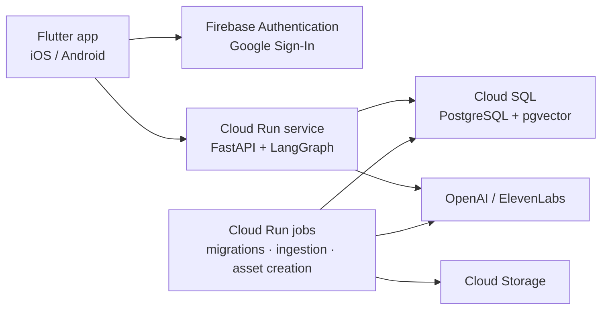

# Wobot

Wobot is an AI spokesperson app for a gerontechnology research center and its
affiliated smart-care company. It answers questions grounded in approved
sources — the organizations' public websites and a product catalog — recommends
smart-care products neutrally, and talks through either a text chat or a
personalized cartoon avatar that speaks with the user's cloned voice.

It is built for an internal pilot of up to ten people.

**Status:** Phase 0 (deployment skeleton) in progress.

## Architecture

- One public API service. Long-running work — schema migrations, knowledge
  ingestion, avatar and voice creation — runs as Cloud Run jobs.
- All Google Cloud resources live in `asia-east1` (Taiwan).
- The app never holds provider secrets or database credentials. The API
  verifies a Firebase ID token and an email allowlist on every request.

## Repository layout

| Path | Contents |
| --- | --- |
| `app/` | Flutter client for iOS and Android (planned) |
| `backend/` | Python API, LangGraph agents and jobs (planned) |
| `infra/` | Google Cloud runbook, environment template, database bootstrap |
| `firmware/` | Raspberry Pi Pico W firmware for a robot head; out of scope for v1 |

## Roadmap

| Phase | Scope |
| --- | --- |
| 0 · Deployment skeleton | Sign-in → Cloud Run → Cloud SQL end to end; migrations as a job; keyless CI/CD |
| A · Knowledge | Ingest websites, images and the product catalog into versioned records, chunks and embeddings |
| B · Agentic RAG | LangGraph routing, retrieval tools, neutral recommendation, RAGAS evaluation |
| C · Identity & chat | Conversations, streaming, cancellation and retry in the app |
| D · Avatar & voice | 21-frame cartoon avatar, voice clone, spoken turns |
| E · Operations & pilot | Scheduled updates, deletion, backups, on-device validation |
